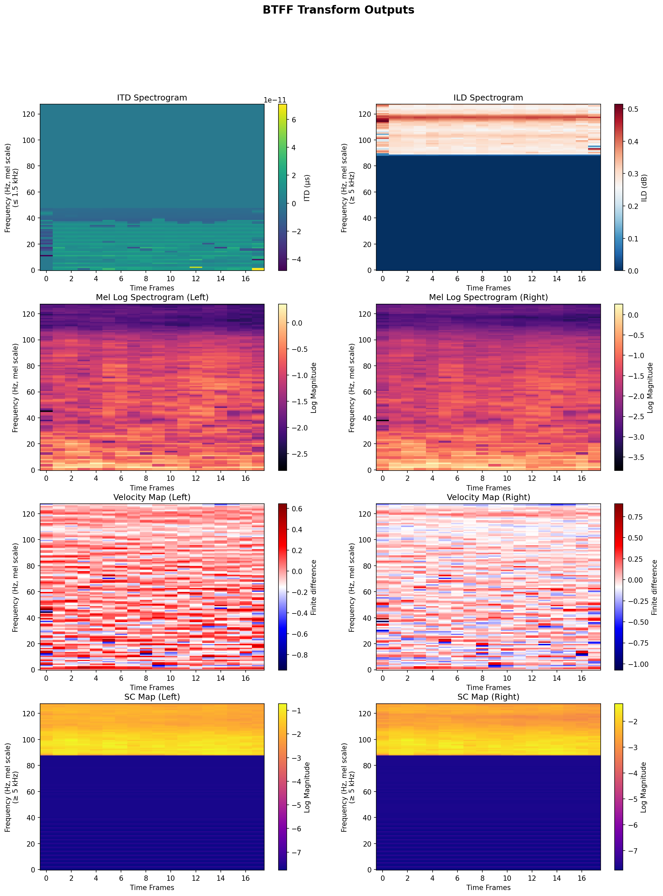

# BTFF - Binaural Time-Frequency Features

A PyTorch-based library for computing binaural audio features including Interaural Time Difference (ITD), Interaural Level Difference (ILD), Mel spectrograms, velocity maps, and high-frequency spectral cues.

## From The paper [Binaural Sound Event Localization and Detection based on HRTF Cues for Humanoid Robots](https://arxiv.org/abs/2507.20530)

<small>*Note: I am not the author of the paper; I only implemented the HRTF audio feature extraction part to the best of my ability.*</small>

## HRTF Features

Below are the primary HRTF-derived features produced by this library. Each entry shows the short label used in the code and a concise description.

- **ITD** — Interaural Time Difference: time delay between left and right ear signals useful for horizontal localization. (1 channel)
- **ILD** — Interaural Level Difference: intensity/level difference between left and right channels, useful for high-frequency localization. (1 channel)
- **Mel** — Mel spectrograms: perceptually motivated time–frequency representation derived from each ear's signal. (2 channels: left and right)
- **V** — Velocity maps: temporal gradients of the Mel spectrograms capturing rapid spectral changes. (2 channels: left and right)
- **SC** — Spectral Cues map: high-frequency portion of the Mel spectrograms useful for vertical Localization. (2 channels: left and right)

notice how some features have empty values because they are high/low pass filtered versions of the STFT before being processed into mel scale.
the paper authors do it like this to keep all inputs equal in size so they can work with CNNs.




## Library Features

- **Binaural Audio Processing**: Extract spatial audio features from stereo HRTF recordings
- **Time-Frequency Analysis**: Compute ITD, ILD, Mel spectrograms, velocity maps, and spectral cues
- **Batch Processing**: Fast batch processing for multiple audio files
- **GPU Accelerated**

## Installation

### Install from source (editable mode)

Clone the repository and install in editable mode:

```bash
git clone https://github.com/Heterochromi/Binaural-Time-Frequency-Feature-Extraction.git
cd Binaural-Time-Frequency-Feature-Extraction
pip install -e .
```

This allows you to modify the source code and see changes immediately without reinstalling , i recommend using this because you will most likely want to change the code yourself.

### Install from source (standard mode)

```bash
git clone https://github.com/Heterochromi/Binaural-Time-Frequency-Feature-Extraction.git
cd Binaural-Time-Frequency-Feature-Extraction
pip install .
```

## Requirements
- python 3.9 - 3.12
- PyTorch
- TorchAudio


## Quick Start

### Single File Processing

```python
from btff import BtffTransoform
# Initialize the transform
transform = BtffTransoform(
    input_audio_path="path/to/stereo_audio.wav",
    n_fft=1024,
    n_mels=128,
    fmin=0,
    fmax=16000,
    device="cpu"  # or "cuda" switching to cuda for a single file will most likely be slower due to IO overhead, maybe faster for large files
)

# Extract all features
features = transform.btff_features(
    itd_start_freq=0, # optional default is copied from the paper's values
    itd_stop_freq=1500, # optional default is copied from the paper's values
    ild_start_freq=5000, # optional default is copied from the paper's values
    sc_map_start_freq=5000 # optional default is copied from the paper's values
)

# Access individual features
itd = features['itd']                    # Interaural Time Difference
ild = features['ild']                    # Interaural Level Difference
mel_left = features['mel_left_spec']     # Left channel Mel spectrogram
mel_right = features['mel_right_spec']   # Right channel Mel spectrogram
v_left = features['v_map_left']          # Left channel velocity map
v_right = features['v_map_right']        # Right channel velocity map
sc_left = features['sc_map_left']        # Left channel spectral centroid
sc_right = features['sc_map_right']      # Right channel spectral centroid

```

#### process a single feature

```python

itd = transform.ITD_spect(
    start_freq=0, # optional default is copied from the paper's values
    stop_freq=1500 # optional default is copied from the paper's values
)

ild = transform.ILD_spect(
    start_freq=5000 # optional default is copied from the paper's values
)

mel_left, mel_right = transform.mel_spec()

v_left, v_right = transform.v_map()

sc_left, sc_right = transform.sc_map(
    start_freq=5000 # optional default is copied from the paper's values
)

```

### Batch Processing

```python
from btff import BtffBatchProcessor

# Initialize batch processor
processor = BTFFBatchProcessor(
    n_fft=1024, #  optional default is 1024, paper does not specify
    n_mels=128, #  optional default is 128, paper does not specify
    fmin=0,
    fmax=16000, # optional default is copied from the paper's values
    device="cuda", # optional default cuda if available else cpu
    batch_size=16
)

# List of audio file paths
audio_paths = [
    "audio1.wav",
    "audio2.wav",
    "audio3.wav",
    # ... more files
]

# or if you an entire directory
from typing import List , Path
audio_dir = Path("/path/to/audio/directory")
audio_paths = list(audio_dir.glob("*.wav"))

proccessed_files = processor.process_files(audio_paths)

# Process in batches
for batch in proccessed_files:
    # Access stacked features: [batch_size, 8, n_mels, time_frames]
    all_features = batch.features

    # Access individual features: [batch_size, n_mels, time_frames]
    itd = batch['itd']
    ild = batch['ild']

    # Get metadata
    print(f"Batch size: {batch.batch_size}")
    print(f"File paths: {batch.paths}")
    print(f"Feature names: {list(batch.keys())}")
```

## API Reference

### `BtffTransoform`

Single file BTFF feature extractor.

**Parameters:**
- `input_audio_path` (str): Path to stereo audio file
- `n_fft` (int): FFT size (default: 1024)
- `n_mels` (int): Number of Mel bands (default: 128)
- `fmin` (int): Minimum frequency (default: 0)
- `fmax` (int): Maximum frequency (default: 16000)
- `device` (str): 'cpu', 'cuda' (default: cpu)

**Methods:**
- `process_file()`: Extract all binaural features
- `ITD_spect()`: Compute ITD spectrogram
- `ILD_spect()`: Compute ILD spectrogram
- `mel_spect()`: Compute Mel spectrograms
- `v_map()`: Compute velocity maps
- `sc_map()`: Compute spectral cue maps

### `BtffBatchProcessor`

Batch processor for efficient multi-file processing.

**Parameters:**
- `n_fft` (int): FFT size (default: 1024)
- `n_mels` (int): Number of Mel bands (default: 128)
- `fmin` (int): Minimum frequency (default: 0)
- `fmax` (int): Maximum frequency (default: 16000)
- `device` (str): 'cpu', 'cuda', or None for auto-detection
- `batch_size` (int): Number of files to process per batch (default: 32)

**Methods:**
- `process_files(audio_paths)`: Process multiple audio files in batches


## Features Explained

### ITD (Interaural Time Difference)
Time delay between left and right ear signals, crucial for horizontal sound localization.

### ILD (Interaural Level Difference)
Intensity difference between left and right channels, important for high-frequency localization.

### Mel Spectrograms
Human hearing Perceptually-motivated frequency representation of audio signals.

### Velocity Maps
Temporal gradient of Mel spectrograms, capturing temporal dynamics.

### Spectral Cue Maps
simply the high-frequency(high passed) portion of the STFT proccessed using mel filterbanks to become mel spectrograms.

the reason why its proccessed this way is because mel filterbanks are non-uniform and overlapping so information from lower frequencies can “leak” into higher mel bins due to this overlap.

humans are known to use high-frequency spectral cues for vertical localization, Spectral cues for elevation come mainly from pinna-induced notches and peaks above ~5 kHz.

these are single ear cues (monaural cues) that are important for vertical localization yet are delicate and small so any "leak" from the lower frequencies can cause some information loss.

## Use Cases

- Machine learning on binaural audio
- Sound source localization
- HRTF (Head-Related Transfer Function) analysis while focusing specifically on human hearing related cues
- Psychoacoustic research


## License

MIT License

## Citations

```bibtex
@paper{lee2025biseld,
  title={Binaural Sound Event Localization and Detection based on HRTF Cues for Humanoid Robots},
  author={Gyeong-Tae Lee, Hyeonuk Nam, Yong-Hwa Park},
  year={28 Jul 2025},
  url={https://arxiv.org/abs/2507.20530}
}
```
[Binaspect](https://github.com/QxLabIreland/Binaspect) was used for reference to create this project since it very similarly focuses on binaural audio feature extraction.
if you want more HRTF feature extraction options or full spectrum audio analysis i recommend trying it.
```bibtex
@misc{barry2025binaspectpythonlibrary,
      title={Binaspect -- A Python Library for Binaural Audio Analysis, Visualization & Feature Generation},
      author={Dan Barry and Davoud Shariat Panah and Alessandro Ragano and Jan Skoglund and Andrew Hines},
      year={2025},
      eprint={2510.25714},
      archivePrefix={arXiv},
      primaryClass={cs.SD},
      url={https://arxiv.org/abs/2510.25714},
}
```
